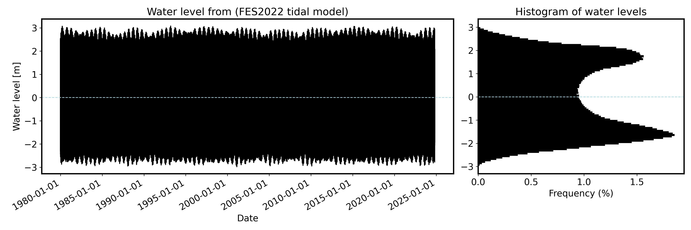
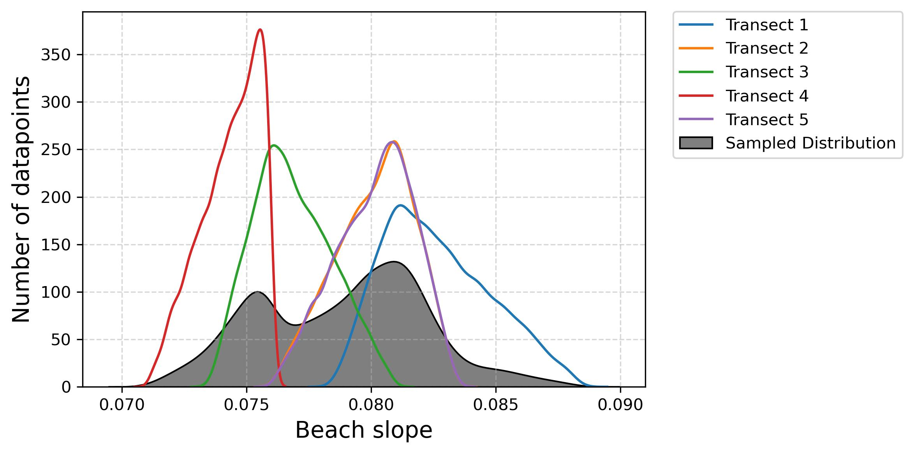
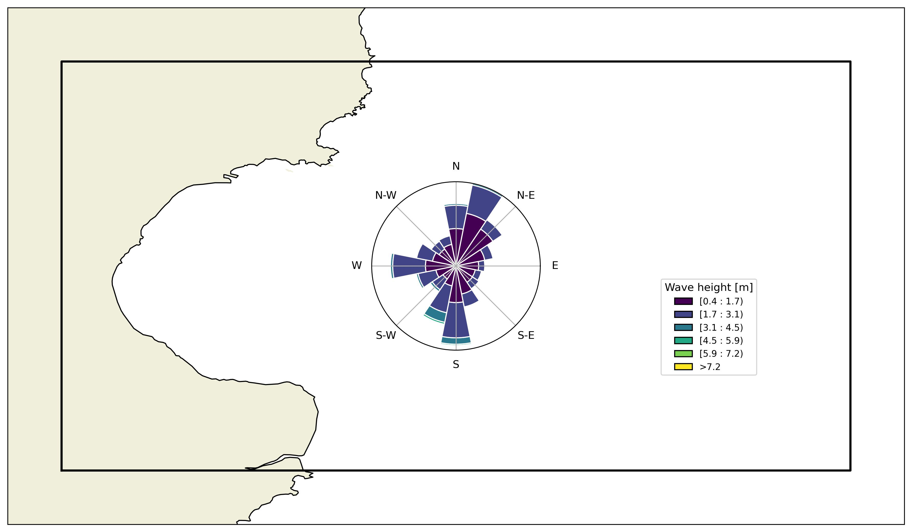

# CoastSat.Venice

This is a fork of the CoastSat repository done by the Sea Level Changes group at Ca'Foscari University of Venice, for use with students and for research purposes. <ins>Please give credit to the original repository</ins> if you use this fork. We are just trying to build up on the exceptional work of K. Vos and his colleagues.

This repository was used as an update of [this work](https://github.com/Alerovere/Beach-Ridges-Runup.git), which was initially carried out for the data retrieval and analysis presented in [this preprint](https://eartharxiv.org/repository/view/7534/). 

## Installation

First, download CoastSat.Venice and unzip it into your hard drive. All the data will be saved in the "Data" folder. 
Go to [this website](https://www.anaconda.com/download/success) and install Anaconda.

### Create an environment with Anaconda

To run the toolbox you first need to install the required Python packages in an environment.You can do this with **Anaconda** . 

Once you have it installed on your PC, open the Miniforge Prompt (in Mac and Linux, open a terminal window) and run the following commands (one by one) to install the `coastsat` environment:

```
conda create -n coastsatVenice
conda activate coastsatVenice
conda install geopandas -y
conda install scikit-image matplotlib astropy notebook -y
pip install earthengine-api
pip install pyqt5 imageio-ffmpeg
pip install ipyleaflet geojson
conda install -c conda-forge pytmd
pip install --upgrade --upgrade-strategy only-if-needed copernicusmarine windrose cartopy seaborn
pip install --no-deps py-wave-ruup
pip install siphon
pip install "dask[distributed]" --upgrade
```

All the required packages have now been installed and are self-contained in an environment called `coastsatVenice`. Always make sure that the environment is activated with:

```
conda activate coastsat
```

To confirm that you have successfully activated CoastSat, your terminal command line prompt should now start with `(coastsatVenice)`.

:warning: **In case errors are raised** :warning:: clean things up with the following command before attempting to install `coastsat` again:
```
conda clean --all
conda update conda
```

### Activate Google Earth Engine Python API

First, create a Google Earth Engine project at https://signup.earthengine.google.com/. 
Then, go to https://cloud.google.com/sdk/docs/install and install the `gcloud CLI`. After you have installed it will automatically launch and let you authenticate with your GEE account (or personal gmail).

:warning: if you're finding that you're always asked to authenticate, open the gloud CLI and run this command: `gcloud auth application-default login` to set a default authentication on your machine.

Download the FES 2022 tidal model
This repository makes use of the pyTMD library to make tidal predictions, that are then used to correct the satellite-derived shoreline for tides. For this, you will need to follow these steps:

1. Go to https://www.aviso.altimetry.fr/ and create an account, then login. Then go to https://www.aviso.altimetry.fr/en/data/data-access/registration-form.html and fill the form, ticking **FES (Finite Element Solution - Oceanic Tides Heights)**.

2. Navigate to My Products (https://www.aviso.altimetry.fr/en/my-aviso-plus/my-products.html) and the FES product should be there as shown here:
 


3. Download [WinSCP](https://winscp.net/eng/download.php) or your favourite SFTP software and click use SFTP link (sftp://ftp-access.aviso.altimetry.fr:2221/auxiliary/tide_model) to create a connection.

4. Then download under /fes2022b the folders /load_tide and /ocean_tide (not /ocean_tide_extrapolate). Download all the components (34 NETCDF files) and unzip them. Save the folders /load_tide and /ocean_tide folders inside the /FES_2022/fes2022b subfolder inside /TidalModels. Make sure that these two folders are called exactly like ocean_tide and load_tide, rename them if necessary.
   


:white_check_mark: If you completed the steps above, you are ready to start using CoastSat.Venice! Open a Jupyter notebook and run the file **"Extract_Shorelines_Tide.ipynb"**.

## How to use
CoastSat.Venice is organised in different notebooks that will need to be run in cascade for everything to work properly. Hereafter, we describe them one by one.

### Calculate_Tides.ipynb
In this notebook, the code allows the user to select a point interactively, and extract tides from the FES 2022 tidal model. Requires subscription to AVISO+ and download of the FES tidal model.


**Tidal data extracted from the FES2022 tidal model for the site of interest**

### Extract_Shorelines_Tide
In this notebook, the code uses CoastSat functions to download Landsat and Sentinel data, calculate shoreline trands and extract slopes. Requires a Google Earth Engine account. For extensive documentation, see the original repository [**here**](https://github.com/kvos/CoastSat.git). The documentation below is just an extract of the extensive documentation by Vos et al. CoastSat is an open-source software toolkit written in Python that enables users to obtain time-series of shoreline position at any coastline worldwide from 40 years (and growing) of publicly available satellite imagery (Landsat and Sentinel-2).


**Beach slope extracted at different transects along thea area of interest**

**Publications describing the CoastSat satellite-derived shorelines:**

- Shoreline detection algorithm: https://doi.org/10.1016/j.envsoft.2019.104528 (Open Access)
- Accuracy assessment: https://doi.org/10.1016/j.coastaleng.2019.04.004
- Challenges in meso-macrotidal environments: https://doi.org/10.1016/j.geomorph.2021.107707
- Basin-scale shoreline mapping (Pacific): https://www.nature.com/articles/s41561-022-01117-8 (The Conversation article [here](https://theconversation.com/millions-of-satellite-images-reveal-how-beaches-around-the-pacific-vanish-or-replenish-in-el-nino-and-la-nina-years-198505))
- Beach slope estimation: https://doi.org/10.1029/2020GL088365 (preprint [here](https://www.essoar.org/doi/10.1002/essoar.10502903.2))
- Beach slope dataset for Australia: https://doi.org/10.5194/essd-14-1345-2022
</details>

### Download_Wave_Data.ipynb
This notebook allows selecteing an area within which wave data from the Copernicus Marine data hub are downloaded. This notebook requires subscription to the Copernicus Marine Service. The data is then plotted and filtered for successive use in runup calculations.


**Wave data extracted in the center of the Area of Interest**

### Calculate_Runup.ipynb
Use the wave, tidal data and slope calculated in the previous steps as inputs to the py-wave-runup tool and calculate maximum and minimum runup values in historical times, coupling wave data to the water level at which the waves impacted the coast. Then, a synthetic runup dataset is calculated by resampling tides and wave data to reproduce one million possible water levels at which waves might impact the coast. This is considered representative of a long-term runup database.


**Runup calculated for historical waves and synthetic wave dataset**

## Reporting form in LaTeX
Inside the `Reporting` folder, there is a LaTeX template that writes a simple report on wave runup from the images and data calculated by the script.

## References and Datasets

This section provides a list of references that use the CoastSat toolbox as well as existing shoreline datasets extracted with CoastSat.

### Publications

- Vos K., Splinter K.D., Harley M.D., Simmons J.A., Turner I.L. (2019). CoastSat: a Google Earth Engine-enabled Python toolkit to extract shorelines from publicly available satellite imagery. *Environmental Modelling and Software*. 122, 104528. https://doi.org/10.1016/j.envsoft.2019.104528 (Open Access)

- Vos K., Harley M.D., Splinter K.D., Simmons J.A., Turner I.L. (2019). Sub-annual to multi-decadal shoreline variability from publicly available satellite imagery. *Coastal Engineering*. 150, 160–174. https://doi.org/10.1016/j.coastaleng.2019.04.004

- Vos K., Harley M.D., Splinter K.D., Walker A., Turner I.L. (2020). Beach slopes from satellite-derived shorelines. *Geophysical Research Letters*. 47(14). https://doi.org/10.1029/2020GL088365 (Open Access preprint [here](https://www.essoar.org/doi/10.1002/essoar.10502903.2))

- Vos, K. and Deng, W. and Harley, M. D. and Turner, I. L. and Splinter, K. D. M. (2022). Beach-face slope dataset for Australia. *Earth System Science Data*. volume 14, 3, p. 1345--1357. https://doi.org/10.5194/essd-14-1345-2022

- Vos, K., Harley, M.D., Turner, I.L. et al. Pacific shoreline erosion and accretion patterns controlled by El Niño/Southern Oscillation. *Nature Geosciences*. 16, 140–146 (2023). https://doi.org/10.1038/s41561-022-01117-8

- Castelle B., Masselink G., Scott T., Stokes C., Konstantinou A., Marieu V., Bujan S. (2021). Satellite-derived shoreline detection at a high-energy meso-macrotidal beach. *Geomorphology*. volume 383, 107707. https://doi.org/10.1016/j.geomorph.2021.107707

- Castelle, B., Ritz, A., Marieu, V., Lerma, A. N., & Vandenhove, M. (2022). Primary drivers of multidecadal spatial and temporal patterns of shoreline change derived from optical satellite imagery. Geomorphology, 413, 108360. https://doi.org/10.1016/j.geomorph.2022.10836

- Konstantinou, A., Scott, T., Masselink, G., Stokes, K., Conley, D., & Castelle, B. (2023). Satellite-based shoreline detection along high-energy macrotidal coasts and influence of beach state. Marine Geology, 107082. https://doi.org/10.1016/j.margeo.2023.107082

### Datasets

- Training dataset used for pixel-wise classification in CoastSat (initial version): https://doi.org/10.5281/zenodo.3334147

## Acknowledgments
This work is based on the CoasSat tool. Please give credit to the original repository if you use this work, and make sure you visit [the original repository](https://github.com/kvos/CoastSat) and cite the relevant papers mentioned above. The modifications done within CoastSat.Venice were done in the framework of the WARMCOASTS project, led by A. Rovere at Ca' Foscari University of Venice. This software is part of a project that has received funding from the European Research Council (ERC) under the European Union’s Horizon 2020 research and innovation programme (Grant agreement No. ERC-StG-802414). The code in this repository has been improved and refined with the help of ChatGPT, an AI assistant, for debugging and optimization purposes.
